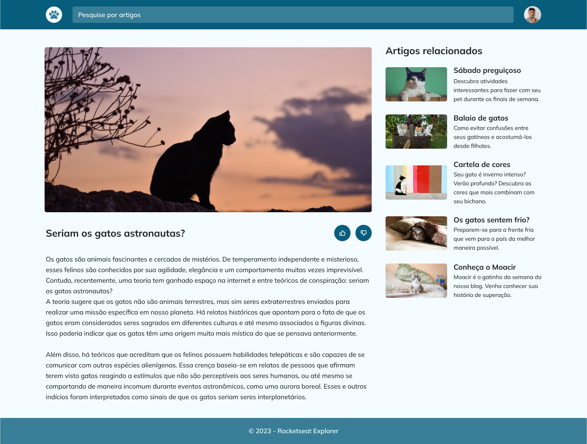

d# React Challenge

## :information_source: About

<div align="center">

Application built to practice some concepts of CSS and HTML 🚀

</div>

<div align= "center">
  
  </div>

```text
Note: Add your project specific Read only files below.
```

## :brain: **Applied Concepts**

<div align="center">

|   :page_facing_up:    |
| :-------------------: |
|     Semantic HTML     |
| CSS > Responsive Page |
|   CSS > Animations    |

</div>
